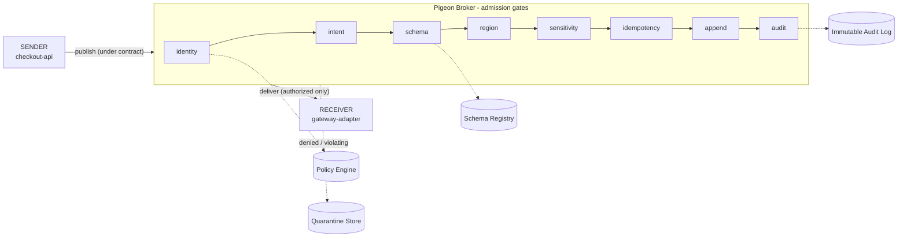

# Pigeon

<p align="center">
  
</p>

[](https://www.npmjs.com/package/pigeonmq)
[](https://github.com/vishnu-77/pigeon/actions/workflows/ci.yml)
[](LICENSE)
[](.nvmrc)

Pigeon is a **policy-compiled messaging broker for governed asynchronous communication**.

It introduces **runtime communication contracts**: subject policies are compiled into
lightweight session contracts, and every message is checked against that contract before
routing, delivery, replay, quarantine, or audit.

> Kafka stores the log. NATS routes the subject. RabbitMQ manages the queue.
> **Pigeon governs the communication contract.**

> **Status:** early-stage and experimental. The broker model and the policy-compiled
> messaging path work and are tested, but this is not production-ready (see
> [Current status](#current-status)).

## Why Pigeon?

Most brokers focus on delivery: topics, queues, streams, and routing. Governance -
*who may send this? is this a retry or a real second charge? who received it?* - gets
bolted on later as sidecars, client libraries, and tribal knowledge. It drifts, and
nobody can prove what was enforced.

Pigeon focuses on the **communication contract** around the message:

- who is allowed to send it
- who can receive it
- which schema applies
- whether idempotency is required
- whether replay is allowed
- whether audit is required
- whether the message should be allowed, denied, or quarantined

## Core idea

```text
Subject Policy
    ↓   compiled once, at connect time
Session Contract     (bound to an authenticated principal)
    ↓   every message runs under it
Message
    ↓
Broker Decision
    ↓
Allow / Deny / Quarantine / Audit
```

A client authenticates and **negotiates a contract** for the subjects it needs; the broker
compiles the relevant policy into that contract (subject, schema, and policy IDs, granted
operations, expiry). Every publish, receive, replay, and ack is validated against the
contract - identity, operation, schema, region, classification, idempotency - **before** the
message is routed, stored, or delivered. Denied messages are audited and, where configured,
quarantined as evidence. Because policy is compiled once per session, enforcement is a fast
table lookup, not a re-parse per message.

Inside the broker, an accepted message passes an ordered chain of gates:



More diagrams (admission, retry, delivery, quarantine, replay) are in [docs/flows.md](docs/flows.md).

## Quickstart

Requires **Node.js ≥ 22**. Zero runtime dependencies.

```bash
npm install pigeonmq                                  # use as a library
# or run the repo directly:
git clone https://github.com/vishnu-77/pigeon.git && cd pigeon
npm test          # 62 tests across broker, contracts, store, HTTP, SDK
npm run demo      # narrated sender → broker → receiver walkthrough
npm start         # HTTP broker + live dashboard on http://localhost:8787
```

`npm run demo` prints the governed flow with each gate visible:

```text
1. Governed payment authorization
   SENDER   ──▶ BROKER   publish authorize_payment (order_456)
     ✓ identity ✓ intent ✓ schema ✓ region ✓ sensitive ✓ idempotency
   ACCEPTED msg_… · seq 1
3. Unauthorized producer is denied at contract negotiation
   ATTACKER ──▶ BROKER   NO_PERMITTED_SUBJECTS - no contract is ever issued
4. Raw card PAN is denied and quarantined as evidence
   DENIED SENSITIVE_FIELD_DENIED · QUARANTINED envelope held as evidence
```

`npm start` also serves a live **Acme Checkout dashboard** at `/` (watch messages flow and
the audit trail stream live) and a versioned **API reference with "Try it"** at `/docs`.

### Send a message

In-process (Node):

```js
import { PigeonBroker, registerDemoSubjects } from "pigeonmq";

const broker = registerDemoSubjects(new PigeonBroker());

// Negotiate a session contract, then publish under it.
const checkout = broker.connect(
  { principal: { id: "spiffe://merchant-prod/ns/checkout/sa/checkout-api" }, region: "uk" },
  { subjects: ["payments.authorize"] }
);
checkout.request("payments.authorize",
  { merchantId: "m", orderId: "o1", amount: 42.5, currency: "GBP", paymentToken: "tok" },
  { intent: "authorize_payment", idempotencyKey: "o1:auth", classification: "pci", region: "uk" });
```

Over HTTP (any language) - authenticate, negotiate a contract, publish under it:

```bash
# 1. negotiate → { "contract": { "id": "contract_1", ... } }
curl -X POST localhost:8787/v1/contracts \
  -H "authorization: Bearer checkout-token" -d '{ "subjects": ["payments.authorize"] }'

# 2. publish under the contract
curl -X POST localhost:8787/v1/messages \
  -H "authorization: Bearer checkout-token" -H "x-pigeon-contract: contract_1" \
  -d '{ "subject":"payments.authorize","type":"t","source":"checkout","intent":"authorize_payment",
        "idempotencyKey":"o1:auth","classification":"pci","region":"uk",
        "data":{"merchantId":"m","orderId":"o1","amount":42.5,"currency":"GBP","paymentToken":"tok"} }'
```

A [TypeScript SDK](sdk/typescript/README.md) wraps auth + contract negotiation.

## Example policy

Subjects are authored as data - JSON files under [`policies/`](policies/) (or JS objects).
A trimmed `payments.authorize`:

```json
{
  "name": "payments.authorize",
  "mode": "requestReply",
  "intents": ["authorize_payment"],
  "schema": { "name": "payment.authorization.v1" },
  "regionPolicy": { "allowedRegions": ["uk", "eu"] },
  "delivery": { "idempotency": { "required": true } },
  "data": { "classification": "pci", "forbiddenFields": ["card.pan"] },
  "quarantine": { "onSchemaViolation": true, "onPolicyViolation": true },
  "policy": {
    "publish": [{ "effect": "allow", "principals": ["spiffe://merchant-prod/ns/checkout/sa/checkout-api"] }],
    "receive": [{ "effect": "allow", "principals": ["spiffe://merchant-prod/ns/payments/sa/gateway-adapter"] }]
  }
}
```

Lint a policy directory with `pigeon policy lint policies`. See
[ADR-0003](docs/adr/0003-json-policy-language-over-cedar-rego.md) for why policy is
structured data rather than a rule language.

## What makes it different?

| System | Core primitive | Strength | Pigeon difference |
| --- | --- | --- | --- |
| Kafka | Topic partition log | Durable streaming and replay | Pigeon governs runtime communication contracts |
| NATS | Subject | Low-latency messaging and request/reply | Pigeon turns subjects into policy-backed contracts |
| RabbitMQ | Exchange and queue | Routing, ACK/NACK, work queues | Pigeon governs whether the flow is allowed before routing |
| **Pigeon** | **Session contract over subject policy** | **Governed async communication** | **Policy-compiled runtime enforcement** |

## Current status

Pigeon is **early-stage and experimental**. The runtime, the policy-compiled contract path,
and the single-node broker all work and are tested (62 tests, CI on Node 22 & 24, CodeQL +
secret scanning). It is **not production-ready**: authentication uses static demo bearer
tokens (real deployments need mTLS/SPIFFE/JWT), and session contracts are in-memory and
single-node.

Implemented today:

- [x] Broker runtime (publish / receive / replay / ack)
- [x] Subject-based messaging
- [x] Policy loading (JSON files + linter)
- [x] Policy compilation (subject/policy/schema IDs, permission index)
- [x] Session contract negotiation
- [x] Runtime contract enforcement
- [x] Schema validation
- [x] Idempotency checks (TTL dedupe window)
- [x] Audit events (hash-chained, optionally durable)
- [x] Quarantine (with authorized release)
- [x] Rate limiting
- [x] Durable store (append-only, via `PIGEON_DATA_DIR`)
- [x] CLI (`broker start`, `policy lint`, `publish`, `quarantine`)
- [x] Docker (three-container simulation)
- [x] SDK (TypeScript)

Not yet: authenticated identity at the edge (mTLS/SPIFFE/JWT), distributed/persisted
contracts, streaming consumers and queue leases. See [docs/backlog.md](docs/backlog.md) and
the [roadmap](docs/vision.md#roadmap).

## What Pigeon is not

Pigeon is not trying to replace Kafka, NATS, or RabbitMQ on day one, and it is not a
workflow engine, an API gateway, or a generic message queue. It is exploring a different
primitive:

> **policy-compiled messaging** - runtime session contracts over subject policy.

## Documentation

- **Architecture:** [docs/mvp-architecture.md](docs/mvp-architecture.md) · flows: [docs/flows.md](docs/flows.md)
- **Session contracts:** [ADR-0006](docs/adr/0006-session-contracts.md) · all decisions: [docs/adr/](docs/adr/)
- **Policy & use cases:** [docs/use-cases.md](docs/use-cases.md) · example policies: [`policies/`](policies/)
- **Vision & roadmap:** [docs/vision.md](docs/vision.md) · status: [docs/progress.md](docs/progress.md) · backlog: [docs/backlog.md](docs/backlog.md)
- **Containers:** [docs/local-container-simulation.md](docs/local-container-simulation.md) · **SDK:** [sdk/typescript/](sdk/typescript/README.md)
- **Security:** [SECURITY.md](SECURITY.md)

## Contributing

Contributions are welcome - see [CONTRIBUTING.md](CONTRIBUTING.md) for development setup,
project layout, and how to add a subject. Significant technical decisions are recorded as
[Architecture Decision Records](docs/adr/). Please read the
[Code of Conduct](CODE_OF_CONDUCT.md); report security issues via
[SECURITY.md](SECURITY.md) rather than opening a public issue.

## License

Licensed under the [Apache License 2.0](LICENSE).
