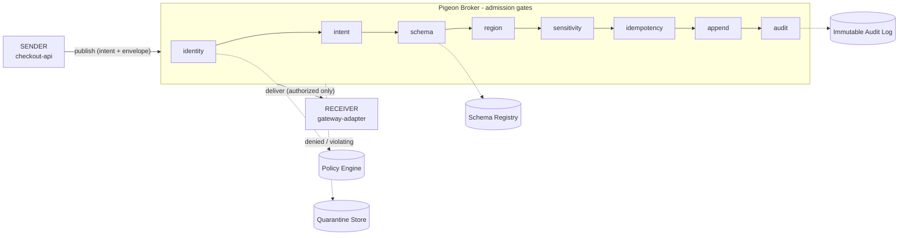

# Pigeon

<p align="center">
  
</p>

[](https://github.com/vishnu-77/pigeon/actions/workflows/ci.yml)
[](LICENSE)
[](.nvmrc)

**Pigeon is policy-native messaging** - an async communication layer where *delivery
semantics and governance semantics are the same contract*.

```text
Messages carry intent.
Subjects carry policy.
Brokers enforce guarantees.
```

A producer doesn't just publish bytes to `payments.authorize`. It submits an
intent-bound operation to a **governed subject** whose policy decides who may send,
who may receive, how retries work, whether replay is legal, where data may move, and
what must be audited - enforced by the broker on every message.

This repo is a **dependency-free, single-node MVP** of that model, complete with a
runnable payment-authorization demo, a work-queue demo, an HTTP API, and a
three-container network simulation.

---

## The problem

Most brokers move bytes from A to B. Governance - *who is allowed to send this? can
it leave the region? is this a retry or a real second charge? who received it?* -
gets bolted on later as sidecars, client libraries, and tribal knowledge. It drifts,
and nobody can prove what was enforced.

## What Pigeon guarantees

At admission and at delivery, the broker enforces - per subject - identity, intent,
schema, region/residency, data classification, forbidden sensitive fields, mandatory
idempotency, duplicate suppression, governed replay, quarantine of violations, and an
immutable audit trail. Every accept and deny is recorded.

## Architecture

A message travels `sender → broker → receiver`, but inside the broker it passes an
ordered chain of policy gates before it is ever appended or delivered:



More diagrams (admission, retry/idempotency, delivery, quarantine, replay) are in
[docs/flows.md](docs/flows.md); the component view is in
[docs/mvp-architecture.md](docs/mvp-architecture.md).

## Quickstart

Requires **Node.js ≥ 22**. No install step, no runtime dependencies.

```bash
npm test         # 36 tests across broker, store, and HTTP server
npm run demo     # narrated sender → broker → receiver walkthrough
npm start        # HTTP broker + Acme Checkout dashboard on http://localhost:8787
```

`npm run demo` prints the whole governed flow as a transmit between principals, with
each policy gate visible:

```text
1. Governed payment authorization
   SENDER    ──▶ BROKER     publish authorize_payment (order_456)
     ✓ identity     checkout-api is an allowed producer
     ✓ intent       authorize_payment permitted on subject
     ✓ schema       matches payment.authorization.v1
     ✓ region       uk is inside uk|eu
     ✓ sensitive    no raw card.pan present
     ✓ idempotency  order_456:authorize is new
   ACCEPTED msg_… · seq 1

2. Retry with the same idempotency key (no double charge)
   SENDER    ──▶ BROKER     publish authorize_payment (order_456) - retry
   DUPLICATE returned original msg_…

3. Unauthorized producer is denied at admission
   ATTACKER  ──▶ BROKER     publish authorize_payment (order_789)
   DENIED POLICY_DENIED - catalog-api is not allowed to publish on payments.authorize.

4. Raw card PAN is denied and quarantined as evidence
   SENDER    ──▶ BROKER     publish authorize_payment with card.pan
   DENIED SENSITIVE_FIELD_DENIED - card.pan is forbidden on payments.authorize.
   QUARANTINED envelope held as forensic evidence

5. Receiver pulls only the authorized message
   BROKER    ──▶ RECEIVER   gateway-adapter receives payments.authorize
   DELIVERED 1 message(s): order_456
```

## See it in action (Acme Checkout)

The broker also serves a zero-dependency **live dashboard** that shows Pigeon governing a
real application - an e-commerce checkout:

```bash
npm start                     # then open http://localhost:8787/
```

Click **Place order** and watch a message travel `ORDER SERVICE → PIGEON BROKER → RECEIVERS`:
the six policy gates light up, the payment is authorized on `payments.authorize`, an order
confirmation is published on `notifications.send`, and both are delivered - while the
**audit trail streams live**. The scenario buttons show governance in the failure cases too:

| Button | What the broker does |
| --- | --- |
| **Place order** | Authorize payment, then send confirmation; all gates pass, both delivered. |
| **Retry same order** | Same idempotency key → `DUPLICATE`, no double charge. |
| **Unauthorized service** | A different workload is denied at the identity gate (`403`). |
| **Leak card PAN** | Raw `card.pan` is denied and **quarantined** as evidence (`422`). |
| **Wrong region (us)** | Out-of-region publish is denied. |

The dashboard shows every **message sent and received** (click a row to inspect the
envelope) and streams the audit trail live. It drives the real HTTP API on the same origin -
nothing is faked.

For integrating from your own app, the broker also serves a versioned **API reference with a
live "Try it"** at `http://localhost:8787/docs`.

## Using Pigeon in your app

Pigeon can be used two ways. Either way the model is the same: declare a **subject** with
its policy once, then producers publish and consumers receive - the broker enforces the
rules on every message.

### As a library (in-process, Node)

```js
import { PigeonBroker } from "pigeonmq";

const broker = new PigeonBroker();

// 1. Declare the data shape
broker.registerSchema("order.placed.v1", {
  type: "object",
  required: ["orderId", "amount"],
  properties: { orderId: { type: "string" }, amount: { type: "number" } }
});

// 2. Declare the subject: the governed channel plus its policy
broker.registerSubject({
  name: "orders.placed",
  mode: "pubsub",
  intents: ["place_order"],
  schema: { name: "order.placed.v1" },
  regionPolicy: { home: "uk", allowedRegions: ["uk", "eu"] },
  delivery: { idempotency: { required: true } },
  data: { classification: "internal", forbiddenFields: ["customer.ssn"] },
  quarantine: { onSchemaViolation: true, onPolicyViolation: true },
  policy: {
    publish: [{ effect: "allow", principals: ["spiffe://shop/ns/checkout/sa/api"],
                intents: ["place_order"], regions: ["uk", "eu"] }],
    receive: [{ effect: "allow", principals: ["spiffe://shop/ns/fulfil/sa/worker"],
                regions: ["uk", "eu"] }]
  }
});

// 3. Register a credential and negotiate a session contract (identity is bound
//    to the contract, never trusted from the message).
broker.registerToken("checkout-token", { id: "spiffe://shop/ns/checkout/sa/api" });
const checkout = broker.connect(
  { principal: { id: "spiffe://shop/ns/checkout/sa/api" }, region: "uk" },
  { subjects: ["orders.placed"] }
);

// 4. Producer: every call runs under the contract
checkout.request("orders.placed", { orderId: "o_1", amount: 42.5 }, {
  intent: "place_order", idempotencyKey: "o_1:place", classification: "internal", region: "uk"
});

// 5. Consumer: receives only what its contract authorizes
broker.registerToken("worker-token", { id: "spiffe://shop/ns/fulfil/sa/worker" });
const worker = broker.connect(
  { principal: { id: "spiffe://shop/ns/fulfil/sa/worker" }, region: "uk" },
  { subjects: ["orders.placed"] }
);
const messages = worker.receive("orders.placed", { max: 10 });
```

An unauthorized producer is denied at `connect()` (no contract is issued); a disallowed
intent, forbidden field, or wrong region makes the call throw a `PigeonError`, and the
attempt is audited (and quarantined where configured). The rules live on the subject, not
scattered across your services. See `src/subjects.js` for a fuller worked example.

### As a standalone broker (any language, over HTTP)

Run Pigeon as a service (`npm start` or `docker compose up`) and have your services
authenticate, negotiate a contract, then publish under it:

```bash
# 1. Negotiate a session contract (returns { "contract": { "id": "contract_1", ... } })
curl -X POST http://broker:8787/v1/contracts \
  -H "authorization: Bearer checkout-token" -H "x-pigeon-region: uk" \
  -d '{ "subjects": ["orders.placed"] }'

# 2. Producer: publish under the contract
curl -X POST http://broker:8787/v1/messages \
  -H "authorization: Bearer checkout-token" \
  -H "x-pigeon-contract: contract_1" -H "x-pigeon-region: uk" \
  -d '{ "subject":"orders.placed","type":"order.placed","source":"checkout",
        "intent":"place_order","idempotencyKey":"o_1:place","region":"uk",
        "data":{ "orderId":"o_1","amount":42.5 } }'

# 3. Consumer: receive under its own contract
curl -X POST http://broker:8787/v1/subjects/orders.placed/receive \
  -H "authorization: Bearer worker-token" -H "x-pigeon-contract: contract_2" \
  -d '{ "max": 10 }'
```

Or use the [TypeScript SDK](sdk/typescript/README.md), which wraps auth + contract
negotiation. See the [HTTP API](#http-api) for the full endpoint list; the Acme Checkout
dashboard above is exactly this pattern from the browser.

### Installing today

Pigeon is published on npm as **`pigeonmq`** (the name `pigeon` was taken). Use it by:

```bash
npm install pigeonmq                                 # from npm
# or
npm install github:vishnu-77/pigeon                 # add as a git dependency
# or
git clone https://github.com/vishnu-77/pigeon.git   # run the HTTP / Docker broker
```

Current MVP limits: authentication uses static demo bearer tokens (real deployments need
mTLS/SPIFFE/JWT), and session contracts are in-memory and single-node. Durable message
storage is available via `PIGEON_DATA_DIR`. See the [roadmap](docs/vision.md#roadmap).

## Where & how to use it

Pigeon fits anywhere a message is a *governed operation*, not just data.

| Use case | Why Pigeon | Mode |
| --- | --- | --- |
| **Regulated card payments (PCI)** | No double charges, no raw PAN, full audit | request/reply |
| **PII & GDPR data residency** | Keep data in-region, block sensitive fields | work queue |
| **Healthcare / HIPAA events** | Least-privilege access + evidence trail | pub/sub |
| **Multi-tenant SaaS isolation** | Per-tenant identity & policy at the broker | pub/sub / queue |
| **Governed async RPC / commands** | Idempotent commands from authorized callers | request/reply |
| **Audit & compliance evidence** | Immutable trail + quarantine store | any |
| **Reliable work queues** | Governed retries & audited replay | work queue |

Each with a copy-adaptable subject sketch in **[docs/use-cases.md](docs/use-cases.md)**.

## Subject modes

| Mode | Shape | Good for |
| --- | --- | --- |
| Pub/Sub | Fan out to many subscribers | Domain events |
| Durable stream | Ordered append log with offsets | Projections, integration streams |
| Work queue | Competing consumers, leases, acks | Jobs and commands |
| Retained state | Last value per key | Config, device state, presence |
| Request/Reply | Correlated request-response + dedupe | Governed async RPC |

The MVP ships two subjects that exercise different modes and governance:
`payments.authorize` (request/reply, PCI, replay denied) and `notifications.send`
(work queue, PII, replay allowed for an audited ops principal). See `src/subjects.js`.

## HTTP API

Start the broker with `npm start` (or `docker compose up --build`), then:

| Method & path | Purpose |
| --- | --- |
| `GET /health` | Liveness. |
| `GET /v1/subjects` | List subjects with a governance summary. |
| `GET /v1/subjects/:name` | Full subject descriptor. |
| `POST /v1/messages` | Publish a message (`202` accepted, `200` duplicate). |
| `POST /v1/subjects/:name/receive` | Pull authorized messages as a consumer. |
| `GET /v1/audit` | Immutable audit trail. |
| `GET /v1/quarantine` | Quarantined evidence records. |

Identity and region are passed via `x-pigeon-principal` and `x-pigeon-region` headers
(a stand-in for SPIFFE mTLS identity in this MVP). Errors return a structured
`{ error: { code, message, details } }` with appropriate status codes (`403` policy
denials, `422` validation, `400` malformed body, `413` oversized, `404`/`405` routing).

Publish a payment authorization:

```bash
curl -X POST http://localhost:8787/v1/messages \
  -H "content-type: application/json" \
  -H "x-pigeon-principal: spiffe://merchant-prod/ns/checkout/sa/checkout-api" \
  -H "x-pigeon-region: uk" \
  -d '{
    "subject": "payments.authorize",
    "type": "payment.authorization.requested",
    "source": "checkout-service",
    "intent": "authorize_payment",
    "idempotencyKey": "order_456:authorize",
    "classification": "pci",
    "region": "uk",
    "data": {
      "merchantId": "merchant_123",
      "orderId": "order_456",
      "amount": 42.5,
      "currency": "GBP",
      "paymentToken": "tok_visa_abc"
    }
  }'
```

Receive as the gateway adapter:

```bash
curl -X POST http://localhost:8787/v1/subjects/payments.authorize/receive \
  -H "content-type: application/json" \
  -H "x-pigeon-principal: spiffe://merchant-prod/ns/payments/sa/gateway-adapter" \
  -H "x-pigeon-region: uk" \
  -d '{ "max": 10 }'
```

## Container simulation

Run the real cross-container network - a sender and receiver that talk *only* through
the broker over a Docker network:

```bash
docker compose up --build
```

```text
checkout-sender  ──▶  pigeon-broker  ──▶  gateway-receiver
```

Details and the automated one-shot run are in
[docs/local-container-simulation.md](docs/local-container-simulation.md).

## How it works (code map)

| Path | Responsibility |
| --- | --- |
| `src/broker.js` | `PigeonBroker` - admission, delivery, replay, ack, quarantine. |
| `src/policy.js` | Principal / intent / region / attribute rule evaluation. |
| `src/schema.js` | Minimal dependency-free JSON-shape validator. |
| `src/store.js` | `MemoryStore` - message log, ledger, cursors, quarantine (pluggable). |
| `src/subjects.js` | Example subjects + schemas and broker factories. |
| `src/server.js` | HTTP API surface. |
| `examples/walkthrough.js` | The narrated demo. |

## Positioning

Pigeon is to async communication what an API gateway is to HTTP, but deeper - it
governs retry semantics, replay rights, duplicate suppression, audit, and data
movement, not just admission. See the full comparison and north-star design in
**[docs/vision.md](docs/vision.md)**.

## Roadmap

The MVP is Phase 0 (a formal, executable model). The path to a production system:

1. Durable storage - append-only message log plus SQLite/RocksDB indexes (via the
   `MemoryStore` seam in `src/store.js`).
2. Leases, nack, retry backoff, and dead-letter / quarantine-release workflows.
3. Signed policy bundles and per-message policy version pinning.
4. Durable subject definitions from YAML / Kubernetes CRDs.
5. OpenTelemetry spans and metrics.
6. SPIFFE mTLS identity extraction at the HTTP/gRPC boundary.
7. Kafka / NATS / RabbitMQ / SQS bridge adapters (govern without a big-bang migration).

Full phased roadmap in [docs/vision.md](docs/vision.md#roadmap). Current status - what
ships today, what is in flight, and what is next - is tracked in
[docs/progress.md](docs/progress.md).

## Contributing

Contributions are welcome - see [CONTRIBUTING.md](CONTRIBUTING.md) for development
setup, project layout, and how to add a subject. Significant technical decisions are
recorded as [Architecture Decision Records](docs/adr/). Please also read the
[Code of Conduct](CODE_OF_CONDUCT.md). For security issues, follow
[SECURITY.md](SECURITY.md) rather than opening a public issue.

## License

Licensed under the [Apache License 2.0](LICENSE).
