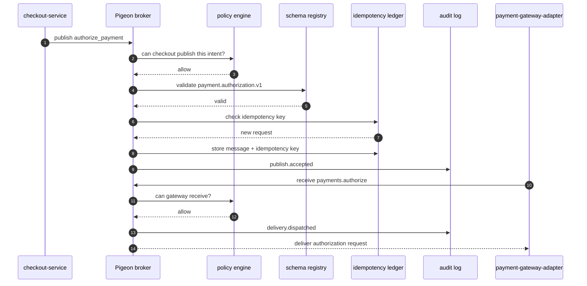
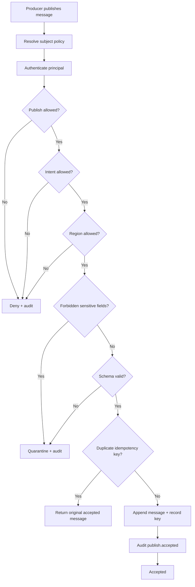
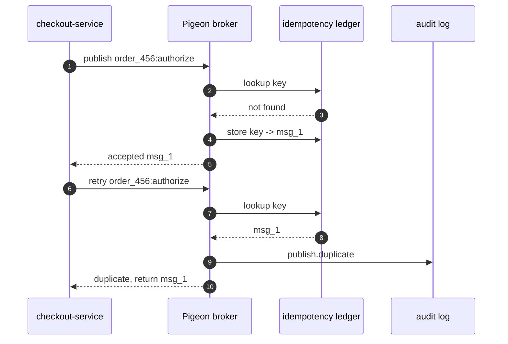
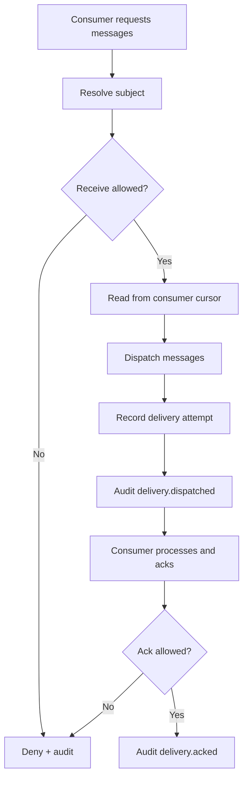
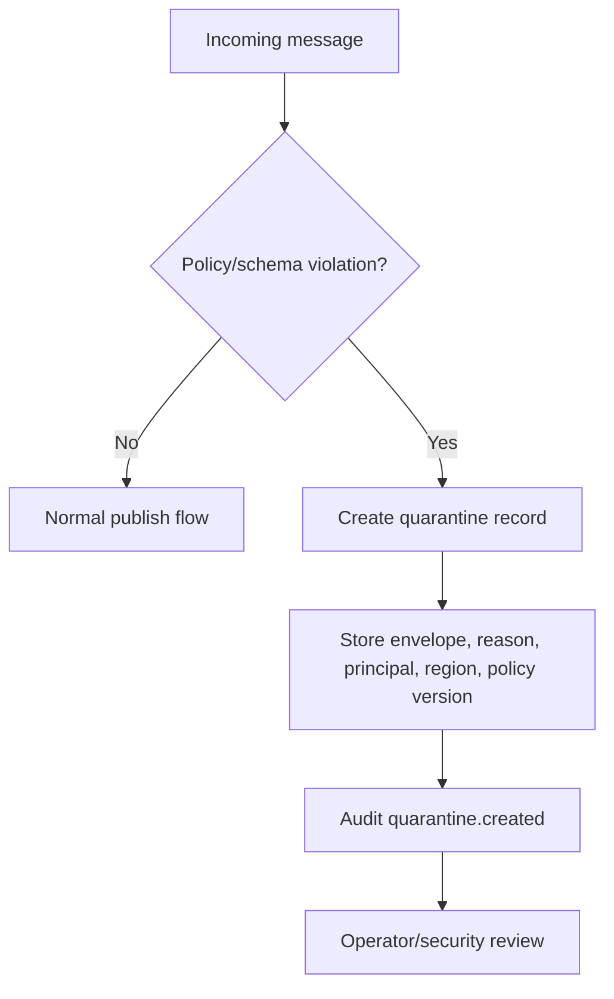
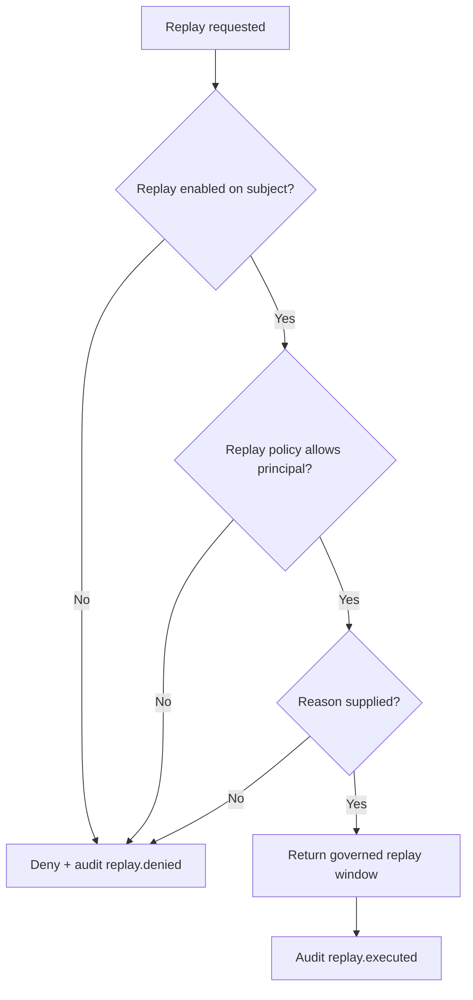

# Pigeon Flows

These diagrams show how Pigeon turns ordinary messaging into governed communication.

## Payment Authorization

## Publish Admission

## Retry And Duplicate Suppression

## Delivery

## Quarantine

## Replay

## Where To Show These

Use these diagrams in:

1. `README.md` for the short product explanation.
2. `docs/flows.md` for engineering and architecture details.
3. GitHub project page or docs site because Mermaid renders directly.
4. Demo scripts or talks to explain why a payment authorization is not just a message from A to B.
