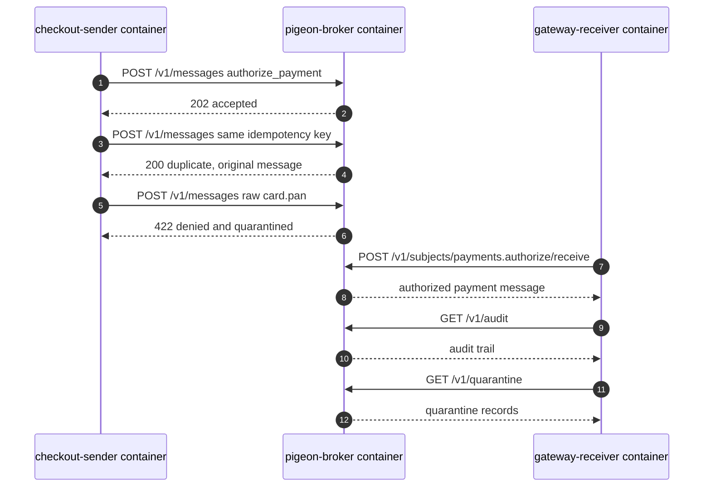

# Local Container Simulation

This simulation runs three networked containers on one Docker network:

```text
checkout-sender  ->  pigeon-broker  ->  gateway-receiver
```

The Docker Compose project is named `pigeon`, and the local images are named:

```text
pigeon-broker:local
pigeon-checkout-sender:local
pigeon-gateway-receiver:local
```

The sender and receiver are separate network applications. They do not call each other directly. They communicate through the Pigeon HTTP API over the Docker network.

## Services

| Service | Role |
| --- | --- |
| `pigeon-broker` | Runs the governed messaging broker on port `8787`. |
| `checkout-sender` | Publishes a `payments.authorize` message as checkout. |
| `gateway-receiver` | Receives the authorized message as the payment gateway adapter. |

## What The Simulation Shows

1. Checkout publishes a payment authorization request.
2. Pigeon validates the sender principal, intent, schema, region, classification, and idempotency key.
3. Checkout retries with the same idempotency key.
4. Pigeon returns the original message instead of creating a duplicate charge.
5. Checkout attempts to send raw `card.pan`.
6. Pigeon denies and quarantines that message.
7. Gateway receives only the authorized message.
8. Receiver prints the audit and quarantine records.

## Run

From the project folder:

```bash
docker compose up --build
```

To run it again from a clean state:

```bash
docker compose down
docker compose up --build
```

For an automated one-shot run that stops after the receiver completes:

```bash
docker compose up --build --abort-on-container-exit --exit-code-from gateway-receiver
docker compose down
```

The broker is also exposed on your host:

```text
http://localhost:8787
```

Health check:

```bash
curl http://localhost:8787/health
```

## Flow


