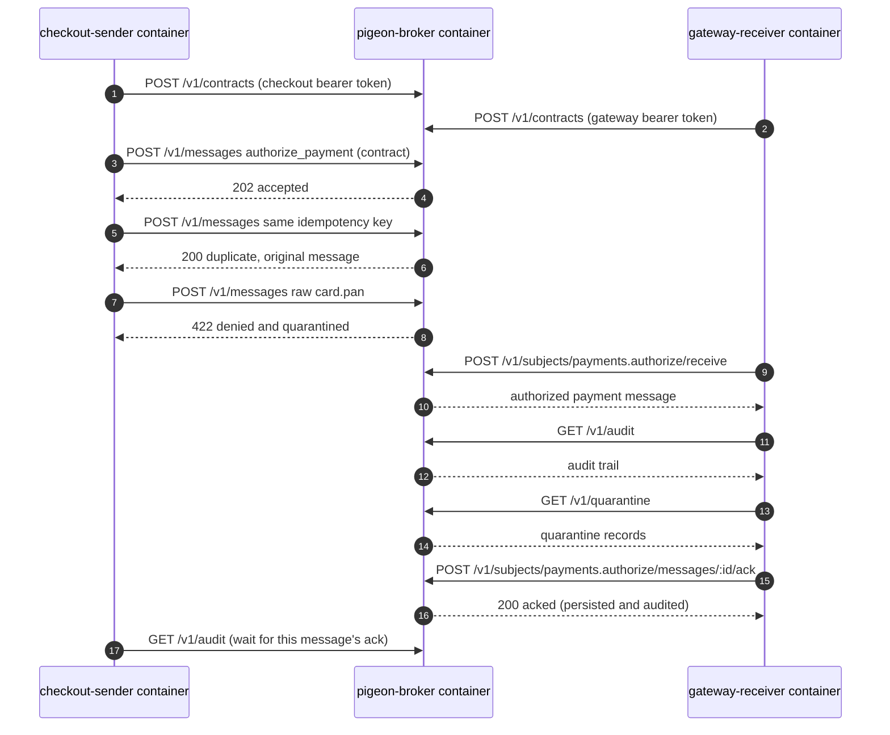

# Local Container Simulation

This simulation runs three networked containers on one Docker network:

```text
checkout-sender  ->  pigeon-broker  ->  gateway-receiver
```

The Docker Compose project is named `pigeon`, and the local images are named:

```text
pigeon-broker:local
pigeon-checkout-sender:local
pigeon-gateway-receiver:local
```

The sender and receiver are separate network applications. They do not call each other directly. They communicate through the Pigeon HTTP API over the Docker network.

## Services

| Service | Role |
| --- | --- |
| `pigeon-broker` | Runs the governed messaging broker on port `8787`. |
| `checkout-sender` | Publishes a `payments.authorize` message as checkout. |
| `gateway-receiver` | Receives the authorized message, verifies governance evidence, and acknowledges processing. |

## What The Simulation Shows

1. Checkout publishes a payment authorization request.
2. Pigeon validates the sender principal, intent, schema, region, classification, and idempotency key.
3. Checkout retries with the same idempotency key.
4. Pigeon returns the original message instead of creating a duplicate charge.
5. Checkout attempts to send raw `card.pan`.
6. Pigeon denies and quarantines that message.
7. Gateway receives only the authorized message.
8. Receiver waits for this order's acceptance, duplicate and redacted quarantine evidence.
9. Receiver acknowledges the message; Pigeon persists the acknowledgement and audits it.
10. Sender observes that acknowledgement before reporting completion.

This demonstrates governed delivery and acknowledgement; it does not call a payment
gateway or return an authorization decision. Delivery is cursor-based, without leases
or automatic redelivery after consumer failure.

## Run

From the project folder:

```bash
npm run demo:network
```

This zero-install Node command starts a private HTTP broker on an available port and
runs the sender and receiver in separate processes. It exits successfully only when both
complete and cleans up the processes. No running broker or Docker is required.

For Docker:

```bash
docker compose up --build
```

To rerun against the same broker state, run the command again. Each sender run gets a
fresh order/idempotency key; the retry within that run uses the same key. Delivery and
acknowledgement records survive broker restarts in the container's `/data` volume.

To recreate the containers:

```bash
docker compose down
docker compose up --build
```

For an automated one-shot run that stops after the receiver completes:

```bash
docker compose up --build --abort-on-container-exit --exit-code-from gateway-receiver
docker compose down
```

To use three terminals instead, start `npm start`, `npm run simulate:receiver`, and
`npm run simulate:sender`. Either client may start first. Run against a dedicated broker;
the dashboard and demo receiver share the gateway principal's cursor and should not
consume simultaneously.

Configuration: `PIGEON_URL` defaults to `http://localhost:8787`; `PIGEON_TOKEN` defaults
to each client's own demo token. `DEMO_TIMEOUT_MS` defaults to 30000, and HTTP requests
time out after at most 5 seconds. Optional `DEMO_RUN_ID` must be fresh per run and should
match in both client environments. The receiver discovers the sender's order when it is
unset. `SENDER_HOLD_OPEN=true` keeps a completed sender alive for Compose's
`--exit-code-from gateway-receiver` workflow. Missing peers, invalid credentials,
unexpected denials, or missing governance evidence produce a nonzero exit.

The broker is also exposed on your host:

```text
http://localhost:8787
```

Health check:

```bash
curl http://localhost:8787/health
```

## Flow


```mermaid
sequenceDiagram
  autonumber
  participant Sender as checkout-sender container
  participant Broker as pigeon-broker container
  participant Receiver as gateway-receiver container

  Sender->>Broker: POST /v1/contracts (checkout bearer token)
  Receiver->>Broker: POST /v1/contracts (gateway bearer token)
  Sender->>Broker: POST /v1/messages authorize_payment (contract)
  Broker-->>Sender: 202 accepted
  Sender->>Broker: POST /v1/messages same idempotency key
  Broker-->>Sender: 200 duplicate, original message
  Sender->>Broker: POST /v1/messages raw card.pan
  Broker-->>Sender: 422 denied and quarantined
  Receiver->>Broker: POST /v1/subjects/payments.authorize/receive
  Broker-->>Receiver: authorized payment message
  Receiver->>Broker: GET /v1/audit
  Broker-->>Receiver: audit trail
  Receiver->>Broker: GET /v1/quarantine
  Broker-->>Receiver: quarantine records
  Receiver->>Broker: POST /v1/subjects/payments.authorize/messages/:id/ack
  Broker-->>Receiver: 200 acked (persisted and audited)
  Sender->>Broker: GET /v1/audit (wait for this message's ack)
```
