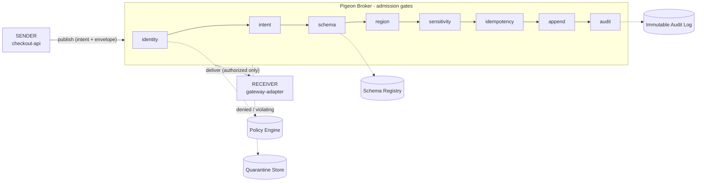
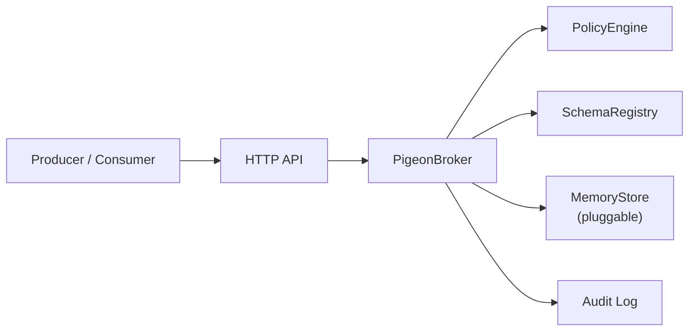

# Pigeon MVP Architecture

The MVP is intentionally small but real.

## Session contracts (the policy-compiled hot path)

Pigeon's core primitive is the **session contract** ([ADR-0006](adr/0006-session-contracts.md)).
A client authenticates (bearer token resolved to a principal server-side), then
*negotiates*: the broker compiles the policy relevant to that principal + the requested
subjects into a runtime contract with a `contract_id`, per-subject `subjectId`/`schemaId`/
`policyId`, the granted operations, and an expiry.

```text
authenticate (token -> principal)
  -> negotiate  (compile policy -> session contract)
  -> publish/receive/replay/ack under contract_id
```

Every message then validates its contract first - belongs to this principal, not expired,
subject + operation in scope - **before** the per-message gates below run. An unauthorized
producer is denied at negotiation and never receives a contract. Policy is compiled to
lookup tables at registration, so the hot path reads tables rather than re-scanning rules.

## Tagged transmit path

A message travels `sender → broker → receiver`, but inside the broker it must pass an
ordered chain of policy gates before it is ever appended or delivered. Edges are
tagged with what crosses them.



## Component view



> The message log, idempotency ledger, delivery cursors, and quarantine store all
> live behind `MemoryStore` (`src/store.js`). A durable backend (SQLite, an
> append-only log) can drop in by implementing the same method surface.

## Admission Path

```text
resolve subject
normalize envelope
evaluate publish policy
enforce intent
enforce idempotency requirement
enforce classification
enforce region
enforce sensitive field policy
validate schema
check duplicate idempotency key
append message
record idempotency key
write audit event
```

## Delivery Path

```text
resolve subject
evaluate receive policy
read from principal cursor
record delivery attempt
write audit event
```

## Current Tradeoffs

- Storage is in-memory by default, with a durable append-only file store available via
  `PIGEON_DATA_DIR` ([ADR-0002](adr/0002-in-memory-storage-pluggable-store.md)).
- Policy language is structured JSON rather than Cedar/Rego ([ADR-0003](adr/0003-json-policy-language-over-cedar-rego.md)); subjects are authorable as JSON files with a linter.
- Identity is authenticated server-side from a bearer token and bound to a session contract; the demo tokens are static and local-only ([ADR-0004](adr/0004-header-based-identity-for-mvp.md), [ADR-0006](adr/0006-session-contracts.md)).
- Delivery is cursor-based (work-queue mode ack-gates redelivery); full queue leases are a next step.
- Request/reply routes replies by `correlationId`; a full response router is future work.

These are deliberate MVP boundaries. The core governed communication model - now including
policy-compiled session contracts - is already executable.

## Decisions behind these tradeoffs

The *why* for the choices above - and other significant decisions such as the
zero-dependency rule and the release process - is recorded as Architecture Decision
Records in [adr/](adr/). Start a new ADR whenever a decision is hard to reverse or would
otherwise survive only as tribal knowledge.
