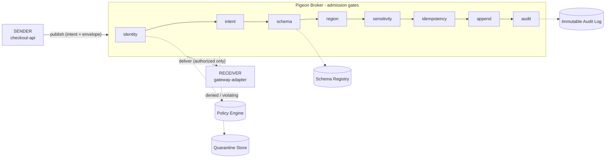
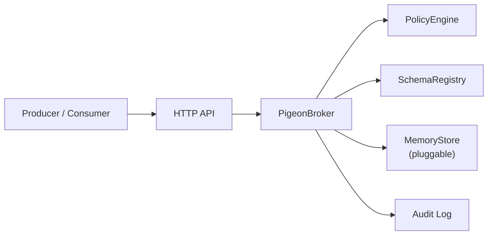

# Pigeon MVP Architecture

The MVP is intentionally small but real.

## Tagged transmit path

A message travels `sender → broker → receiver`, but inside the broker it must pass an
ordered chain of policy gates before it is ever appended or delivered. Edges are
tagged with what crosses them.



## Component view



> The message log, idempotency ledger, delivery cursors, and quarantine store all
> live behind `MemoryStore` (`src/store.js`). A durable backend (SQLite, an
> append-only log) can drop in by implementing the same method surface.

## Admission Path

```text
resolve subject
normalize envelope
evaluate publish policy
enforce intent
enforce idempotency requirement
enforce classification
enforce region
enforce sensitive field policy
validate schema
check duplicate idempotency key
append message
record idempotency key
write audit event
```

## Delivery Path

```text
resolve subject
evaluate receive policy
read from principal cursor
record delivery attempt
write audit event
```

## Current Tradeoffs

- Storage is in-memory ([ADR-0002](adr/0002-in-memory-storage-pluggable-store.md)).
- Policy language is structured JSON rather than Cedar/Rego ([ADR-0003](adr/0003-json-policy-language-over-cedar-rego.md)).
- HTTP identity is passed through headers for local development ([ADR-0004](adr/0004-header-based-identity-for-mvp.md)).
- Delivery is cursor-based; full queue leases are a next step.
- Request/reply is represented through subject mode and correlation fields, not a full response router yet.

These are deliberate MVP boundaries. The core governed communication model is already executable.

## Decisions behind these tradeoffs

The *why* for the choices above - and other significant decisions such as the
zero-dependency rule and the release process - is recorded as Architecture Decision
Records in [adr/](adr/). Start a new ADR whenever a decision is hard to reverse or would
otherwise survive only as tribal knowledge.
