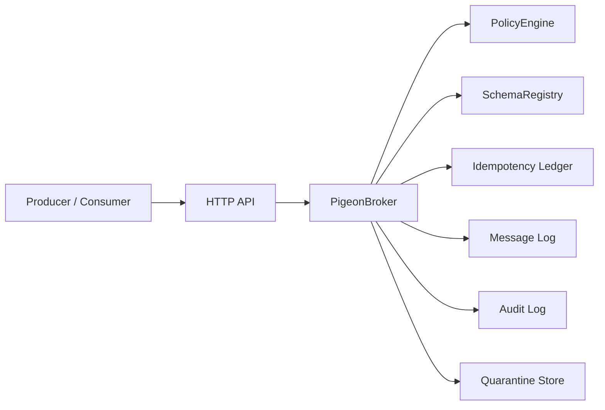

# Pigeon MVP Architecture

The MVP is intentionally small but real.



## Admission Path

```text
resolve subject
normalize envelope
evaluate publish policy
enforce intent
enforce idempotency requirement
enforce classification
enforce region
enforce sensitive field policy
validate schema
check duplicate idempotency key
append message
record idempotency key
write audit event
```

## Delivery Path

```text
resolve subject
evaluate receive policy
read from principal cursor
record delivery attempt
write audit event
```

## Current Tradeoffs

- Storage is in-memory.
- Policy language is structured JSON rather than Cedar/Rego.
- HTTP identity is passed through headers for local development.
- Delivery is cursor-based; full queue leases are a next step.
- Request/reply is represented through subject mode and correlation fields, not a full response router yet.

These are deliberate MVP boundaries. The core governed communication model is already executable.
